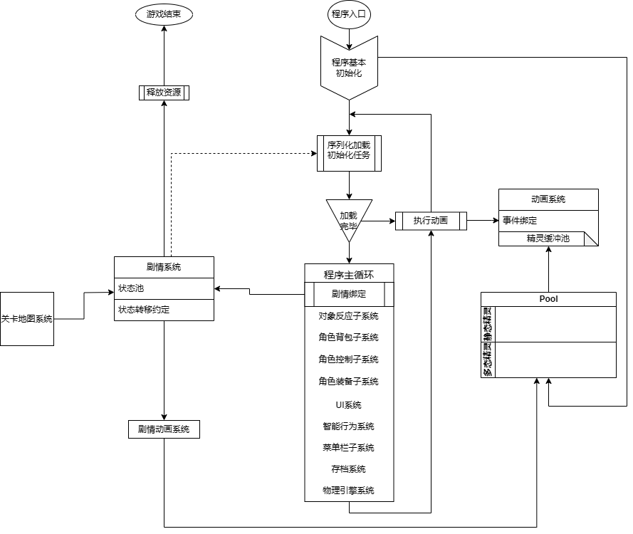

# -Funcode-
## 开始日期：7.22
用作团队开发存储库
## 开发团队: JNMC-四人帮

# 项目说明
------------------------------------------------------------
## 项目logo
### 影之界 XXX
------------------------------------------------------
## 游戏框架
### 影之界 [项目成员编辑通道](https://app.diagrams.net/?client=1#HAliceAuto%2F-Funcode-%2Fmain%2F%E6%B8%B8%E6%88%8F%E6%A1%86%E6%9E%B6%2F%E6%9C%AA%E5%91%BD%E5%90%8D%E7%BB%98%E5%9B%BE.drawio.png#%7B%22pageId%22%3A%22C5RBs43oDa-KdzZeNtuy%22%7D)

### XXX [项目成员编辑通道](https://app.diagrams.net/#HAliceAuto%2F-Funcode-%2Fmain%2F%E6%B8%B8%E6%88%8F%E6%A1%86%E6%9E%B6%2F%E6%B8%B8%E6%88%8F%E6%A1%86%E6%9E%B6_XXX.drawio.png#%7B%22pageId%22%3A%22weIvoqKA7_c4nYOg37wb%22%7D)

--------------------------------------------------------------------
##类图
### 影之界 [项目成员编辑通道](https://app.diagrams.net/?client=1#HAliceAuto%2F-Funcode-%2Fmain%2F%E6%B8%B8%E6%88%8F%E6%A1%86%E6%9E%B6%2F%E6%9C%AA%E5%91%BD%E5%90%8D%E7%BB%98%E5%9B%BE.drawio.png#%7B%22pageId%22%3A%22C5RBs43oDa-KdzZeNtuy%22%7D)

### XXX [项目成员编辑通道](None)

-------------------------------------------------------------
## 准备工作

- **工作台环境:** Funcode平台已经上传qq群文件,文件名  ***Funcode***
- **次要环境:** Photoshop **|** 美图秀秀+GifSplitter
- **项目开发维护环境** 通过打开项目网址来进行授权,参与项目编写[点击进入](https://github.com/AliceAuto/-Funcode-)
    - 创建**github**账户 ***可使用谷歌邮箱Gmail***
    - 下载**github desktop**（可视化Git管理）[点击下载](https://desktop.github.com/download/)
    - 观看具体团体项目开发教学视频[点击观看](https://www.bilibili.com/video/BV1o7411U7j6?vd_source=21be49af9afac52c20366bcfdbce61f2)
-------------------------------------------------
## 项目进度
- [x] 1. 选定游戏题目
- [x] 2. 构思游戏玩法
- [ ] 3.搭建游戏框架
- [ ] 4.项目代码实现与维护
- [ ] 5.游戏素材优化
- [ ] 6.编写文档与比赛制作必要附件
------------------------------------------------------------------
## 项目工具资源
- 资源网站 [爱给网](https://www.aigei.com/) 网址 https://www.aigei.com/
- 位图资源网站 [Opengameart](https://opengameart.org/) 网址 https://opengameart.org/
- AI搜索引擎 [秘塔AI搜索](https://metaso.cn/) 网址 https://metaso.cn/
- 文生图 [Comicai](https://skyreels.ai/dashboard) 网址 https://skyreels.ai/dashboard
- 文生音乐 [Soundraw](https://soundraw.io/edit_music) 网址 https://soundraw.io/edit_music
- 文生视频 [Runway](https://app.runwayml.com/video-tools/teams/sgq2742798794/dashboard) 网址 https://app.runwayml.com/video-tools/teams/sgq2742798794/dashboard
- 文案撰写优化 [GPT](https://openai.com/index/gpt-4/) 网址 https://openai.com/index/gpt-4/
- 角色、背景、音效等资源
    - [Ezgif (序列帧转精灵表)](https://ezgif.com/)：                网址: https://ezgif.com/ [教程](https://blog.csdn.net/hqc17/article/details/52369990)
    - [Kenney](www.kenney.nl/assets)           网址: www.kenney.nl/assets
    - [itch.io](www.itch.io/game-assets/free)    网址: www.itch.io/game-assets/free
    - [GameDev Market](www.gamedevmarket.net)    网址: www.gamedevmarket.net
    - [Craftpix](www.craftpix.net)               网址: www.craftpix.net
- [Github Desktop汉化工具](https://github.com/robotze/GithubDesktopZhTool) 网址 https://github.com/robotze/GithubDesktopZhTool
--------------------------------------------------------------------------------------------
## 学习资源
QQ群文件： 
    ***Funcode 软件设计大赛经验分享*** (这个有必要看)
***Funcode获奖作品展示***

----------------------------------------------------------------
## 项目规范
- **项目编码之前一定要约定项目的命名规范** （我建议采用蛇形命名，使用翻译器英文命名）
- **高效、模块化添加注释**
- **分工明确成员工作嵌合度不要太高**
  
---------------------------------------------------------------------
## 注意
- **项目参与者可  ***~~[完成项目需求]~~*** 以及  ***~~[新建项目需求]~~ 包括库README.md文件*****
- **推荐使用可视化Github desktop**
- **网页Github浏览时尽量不要开翻译插件,因其有时会改变原来的中文**
- **同时多编辑问题**
  - 主分支 (如果不介意自己的更新提交前库的更新，可选择此)
  - 分支 (为自己新建一个分支，完成更新时合并分支，解决库的更新丢失，但需要手动解决冲突)
- **如果更新项目时需要添加新文件夹，请在文件夹中放置一个名为"初始空文件.md"的文件以避免空文件夹不显示的问题**

/%E5%8A%A0%E6%B2%B9.png)
